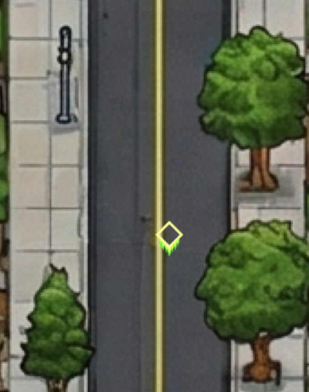
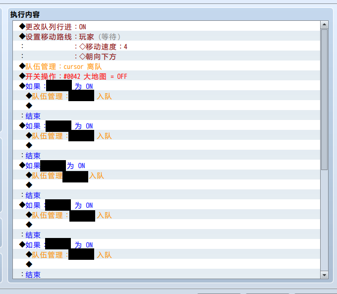
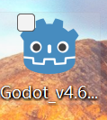
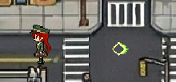
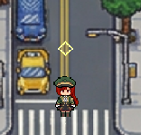

# My Game Sh*tting Diary

## Day1
买了RPGmaker，赢

## Day2
3d模型转立绘+3d模型转像素

## Day3
生成了地图，但物件分离困难，人物在地图上走动没有遮挡违和感极强
想了代替方案，创建人物cursor君，在每次走到大地图时用开关保存当前队伍角色
删除队伍所有角色，然后添加cursor君，这样一个cursor在地图上走没有遮挡很合理
进入房间后读取开关状态，把队伍人物加回来

## Day4
用RPGmaker感觉在屎山雕花，已卸载，已严肃下载godot

## Day5
已写出走路逻辑和跟随逻辑还原rpgmaker队伍系统

## Day6
已写出传送逻辑和物件遮挡/碰撞逻辑
期间发现写完队伍无法关联成员了，学会了删除.godot一键修复bug

## Day7
把codex扔到垃圾桶，它推荐的逻辑导致的我队伍无法关联成员
狗屎codex不懂装懂，还是自己写的代码可靠